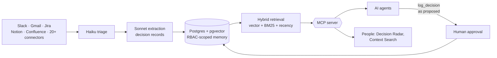

<!-- Profile README for github.com/shubhamshrivastava11 · last updated Oct 2026 -->

 

  

**[About](#about)** · **[Now](#now)** · **[Impact](#impact)** · **[Experience](#experience)** · **[Projects](#projects)** · **[Skills](#skills)** · **[Education](#education)**

---

## About

I'm a product manager with 8+ years across enterprise platforms, AI products and 0→1 builds in healthcare, financial services, government and commerce. I take products from discovery and roadmap through launch and adoption, and I work hands-on with LLMs, RAG, AI agents, APIs and data platforms.

Right now I lead enterprise AI and payments work at **Johnson & Johnson**, and I'm building **[Locus AI](#locus-ai)**, an organizational memory layer that people and AI agents query before they act.

## Now

| | |
|---|---|
| 🧠 **Building** | Locus AI: multi-agent orchestration on shared, permission-aware memory |
| 🏢 **Day job** | Product Manager II, Enterprise AI & Platforms, Johnson & Johnson |
| 📝 **Writing** | A research paper on decision-centric memory for AI agents |
| 🤝 **Open to** | Locus AI design partners, and builders working on agent memory |

## Impact

| | | |
|:---:|:---:|:---:|
| **$2.4M+** annual savings, SAP S/4HANA → AWS across 5 regions | **400+ hrs/month** analyst time reclaimed by LLM/RAG invoice automation | **~12% → <2%** invoice-extraction error rate with guardrails + HITL |
| **~85% → ~97%** regulatory filing success on $50M+ transaction volume | **~41% → ~74%** D2C onboarding conversion across 5 A/B tests | **75K+ installs** 6-month retention ~46% → ~61% |

## Experience

<b>Johnson & Johnson</b> · Product Manager II · New Jersey · <i>Oct 2025 – Present</i>

 

Product direction and delivery across 20+ enterprise AI, payments, data and transformation initiatives in a $75M+ GTS/GFS portfolio, with teams in North America, South America, Asia Pacific and EMEA.

- **JAIDA enterprise AI / invoice automation:** led product work across LLM, RAG and NLP workflows. Reclaimed 400+ analyst hours a month and cut invoice-extraction errors from ~12% to under 2% with guardrails and human-in-the-loop checks.
- **Global SAP S/4HANA → AWS modernization:** roadmap, migration sequencing and rollout across five regions, delivering $2.4M+ in annual savings.
- **IRIS MedTech data platform:** vision, OKRs, discovery and supplier journeys; reduced supplier-onboarding friction by ~25%.
- **Payments & platform portfolio:** coordinated GFS, AP, eMarketplace, data and integration workstreams, with dependency, risk and scope tracking for leadership.
- **Operational intelligence:** Python and Power BI reporting on SAP/AP workflows to surface stuck invoices and exception patterns.

<b>Locus AI</b> · Founder · New York · <i>May 2026 – Present</i>

 

Building an MCP-native organizational-memory layer with 20+ workplace connectors. It keeps decisions, rationale, ownership and source evidence so people and AI agents get grounded context with the right permissions.

- Lead vision, roadmap, discovery and GTM with a distributed 15+ person team. 30+ customer interviews, 40+ users in controlled adoption, B2B pilots in progress.
- Defined the ingestion approach: common event model, deduplication, raw-event storage, queues/workers and source deep links.
- Led multi-level org hierarchy and RBAC, scoping memory by organization, team, project, user and agent.
- Shaped the AI and memory architecture on Claude, hybrid RAG and pgvector/PostgreSQL over MCP, with citations, evals and hallucination guardrails.
- Designed a multi-agent architecture (master PM agent plus developer, tester, data and ML agents) on LangGraph, with human approval gates, provenance and decision-conflict checks.

<b>Deloitte</b> · Product Manager (Contract) · Remote · <i>Apr 2025 – Oct 2025</i>

 

Led delivery of the MSDE Scholarship Portal, a statewide compliance and financial-aid platform used by 15+ public-sector agencies.

- Ran UAT and go-live readiness across 6 modules and worked through 50+ priority defects before launch.
- Reworked a 1,200+ item backlog with AI-assisted clustering, removing roughly a third as duplicates.
- Introduced severity-based SLA triage, cutting resolution time for high-severity issues by more than half.

<b>Cygnus Compliance</b> · Product Manager · New York · <i>Jan 2025 – Mar 2025</i>

 

Delivered a 0→1 AML/KYC compliance platform for a Tier-1 global bank's US correspondent-banking operation within an 8-week regulatory deadline.

- Launched a compliance engine covering ISO 20022, KYC/AML screening, sanctions monitoring and reporting; filing success rose from ~85% to ~97% across $50M+ in volume.
- Led SWIFT MT-to-MX / ISO 20022 migration requirements and release sequencing.
- Partnered on Python-based AML classification and PII anonymization to reduce false-positive review effort.

<b>Digital iTechnology</b> · Product Manager (Contract) · Austin, TX · <i>Mar 2024 – Dec 2024</i>

 

- Helped scale a D2C mobile platform to 75K+ installs; funnel analysis and 5 A/B tests at 95% confidence lifted onboarding conversion from ~41% to ~74%.
- Improved 6-month retention from ~46% to ~61% through activation, lifecycle and usability changes.

<b>Earlier roles</b> · Openlogix · Oakland University · Worldsoft Technologies · <i>2018 – 2023</i>

 

- **Openlogix (a K2 Company), PM Intern, 2023:** 0→1 digital-banking and robo-advisory MVP supporting $2.5M in managed assets.
- **Oakland University, Product Manager, 2022–2023:** FERPA-compliant financial-aid self-service portal; self-service adoption up ~45%.
- **Worldsoft Technologies, Product Manager, 2018–2021:** KYC/onboarding, payment-gateway and REST API requirements for a 30K+ customer digital-banking platform; merchant integrations contributed to an ~18% increase in merchant revenue.

## Projects

### Locus AI

> LLMs reason, RAG retrieves, agents execute. **Locus AI remembers.**

Decisions get made in Slack threads, tickets and docs, then lost. Locus AI captures them as structured records and serves them to people and agents through MCP, so an agent checks what the team already decided before it acts. 2nd place, AI PM Accelerator Cohort 9.

### More builds

| Project | What it does | Status |
|---|---|---|
| **[HeyFurnish](https://heyfurnish.com)** | AI home styling with one budget across every room and neutral, cross-retailer shopping | Live |
| **[AI Job Copilot](https://job-copilot-tau.vercel.app)** | Finds roles, scores fit and tailors application material | Live, in daily use |

## Skills

<b>Full skill list</b>

 

**Product:** strategy · 0→1 development · roadmapping · discovery · customer research · prioritization · OKRs · product analytics · experimentation · GTM · stakeholder management · Agile/Scrum

**AI & data:** LLMs · RAG · AI agents · MCP · prompt engineering · AI evals · hybrid retrieval · Python · SQL · pgvector/PostgreSQL · data quality · human-in-the-loop

**Platforms & tools:** REST APIs · OAuth 2.0 · AWS · Supabase · FastAPI · Salesforce · Jira · Power BI · Figma · Claude API · SAP S/4HANA

**Certifications:** Certified Scrum Product Owner (CSPO) · Certified ScrumMaster (CSM) · Advanced Google Analytics · Product Analytics

## Education

| Degree | School | Year |
|---|---|---|
| M.S., Information Technology Management | Oakland University, Michigan | 2023 |
| B.E., Computer Science | RGPV, Bhopal | 2017 |

<b>GitHub activity</b>

 

<picture>
  <source media="(prefers-color-scheme: dark)" srcset="https://github-readme-stats.vercel.app/api?username=shubhamshrivastava11&show_icons=true&hide_border=true&count_private=true&bg_color=0D1117&title_color=8B7CF6&icon_color=8B7CF6&text_color=C9D1D9" />
  
</picture>
<picture>
  <source media="(prefers-color-scheme: dark)" srcset="https://streak-stats.demolab.com?user=shubhamshrivastava11&hide_border=true&background=0D1117&ring=8B7CF6&fire=8B7CF6&currStreakLabel=8B7CF6&sideLabels=C9D1D9&currStreakNum=C9D1D9&sideNums=C9D1D9&dates=8B949E" />
  
</picture>

---

Always happy to talk with teams running AI agents in production. The fastest way to reach me is <a href="https://linkedin.com/in/shubhamshrivastava11">LinkedIn</a>.

